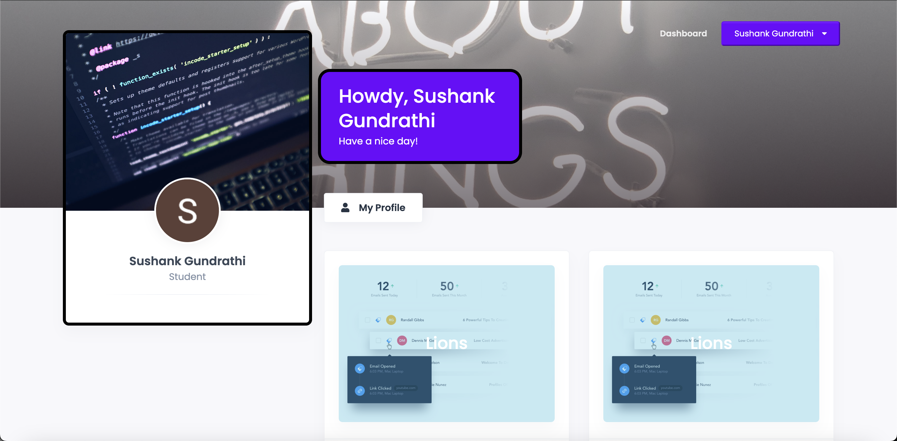
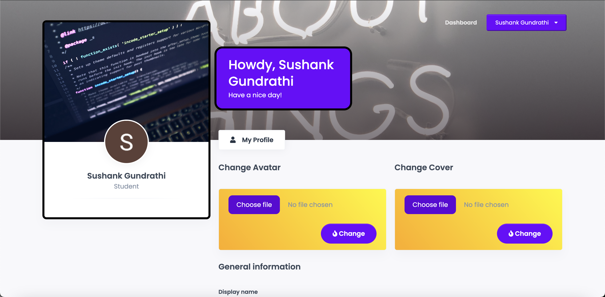
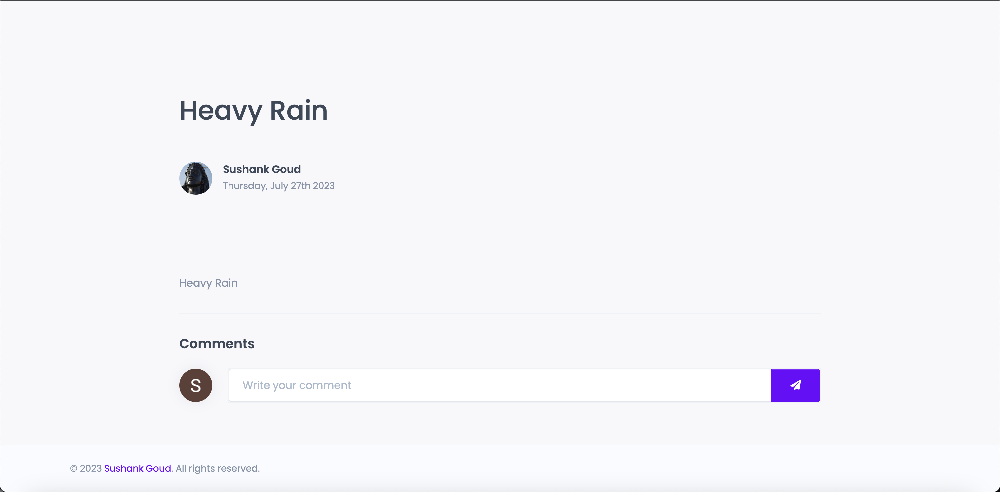
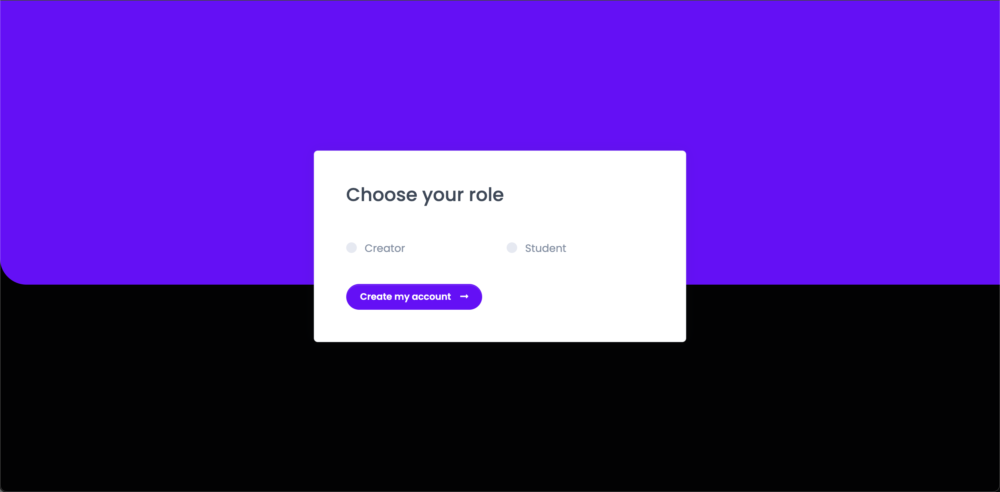

# Learn-Flow: A Dynamic Web Platform for Learning

## Overview

**Learn-Flow** is a dynamic web platform built using the **MERN stack** (MongoDB, Express, React, Node.js), designed to facilitate online learning through video content. The platform features **OAuth 2.0 integration** for secure Google account sign-in, providing a seamless and privacy-conscious user experience. The application also implements **role-based access control** (RBAC), ensuring different levels of access for users based on their roles as "Creators" or "Students."

This project aims to provide an intuitive platform where:
- **Creators** can upload and post learning videos.
- **Students** can access and view posted learning videos.
- Users can engage in structured discussions with an **infinite threaded comment system** under each video.

## Key Features

### 1. **OAuth 2.0 Google Sign-In Integration**
- Implemented **Google OAuth 2.0** for secure authentication, allowing users to log in using their Google accounts.
- Ensured a **privacy-conscious** experience with minimal data access required for sign-in.
  
### 2. **Role-Based Access Control (RBAC)**
- **Creators**: Have the ability to **upload** and **post learning videos** for others to access.
- **Students**: Have the ability to **view** the posted learning videos but cannot upload content.
- Implemented a robust role management system using **JWT (JSON Web Tokens)** for maintaining secure sessions and access control.

### 3. **Infinite Threaded Comment System**
- Designed and implemented a **hierarchical data structure** using MongoDB to support an **infinite threaded comment system**.
- This allows users to post comments under each video, with support for nested replies to create an organized and engaging discussion experience.
  
### 4. **MERN Stack Architecture**
- **MongoDB**: Used as the database for storing user information, videos, and comments in a scalable and flexible way.
- **Express**: Serves as the backend framework to handle API requests, manage routes, and integrate with MongoDB.
- **React**: Used for the frontend, enabling a dynamic and responsive user interface that updates in real time.
- **Node.js**: Powers the backend server, handling API requests and integrating with third-party services like Google OAuth 2.0.

## Technologies Used

- **MongoDB**: Database for storing user data, videos, and comments.
- **Express.js**: Web application framework for Node.js.
- **React.js**: Frontend JavaScript library for building dynamic and responsive UI components.
- **Node.js**: Backend runtime environment for building scalable network applications.
- **OAuth 2.0**: Secure authentication using Google accounts.
- **JWT**: JSON Web Tokens for role-based access control and user session management.
- **HTML/CSS/JavaScript**: Standard web technologies used for building the frontend interface.

## Setup Instructions

### Prerequisites
- **Node.js** installed on your local machine. You can download it from [here](https://nodejs.org/).
- **MongoDB** database or a cloud database service like [MongoDB Atlas](https://www.mongodb.com/cloud/atlas).

### 1. Clone the Repository

```bash
git clone https://github.com/devcrypt6/Learn-Flow.git
cd Learn-Flow
```

### 2. Install Dependencies

Run the following command to install the necessary dependencies for both the frontend and backend:

```bash
npm install
```

### 3. Environment Setup

Create a `.env` file in the root of the project and configure the following environment variables:

```bash
MONGO_URI=<your-mongo-db-uri>
JWT_SECRET=<your-secret-key>
GOOGLE_CLIENT_ID=<your-google-client-id>
GOOGLE_CLIENT_SECRET=<your-google-client-secret>
```

- **MONGO_URI**: Connection string for MongoDB.
- **JWT_SECRET**: Secret key for generating JWT tokens.
- **GOOGLE_CLIENT_ID** and **GOOGLE_CLIENT_SECRET**: Credentials for integrating Google OAuth 2.0.

### 4. Run the Development Server

Start the backend server:

```bash
npm run server
```

Start the frontend:

```bash
npm run client
```

Both the frontend and backend should now be running locally.

### 5. Access the Application

You can access the application in your browser by navigating to:

```bash
http://localhost:3000
```

### 6. Testing the OAuth Integration

- Go to the homepage and sign in using your **Google account** via OAuth.
- The platform will recognize your role (either Creator or Student) based on your credentials and grant appropriate access.

## Contributions

We welcome contributions to **Learn-Flow**! Here’s how you can contribute:

1. Fork the repository.
2. Create a new feature branch (`git checkout -b feature/new-feature`).
3. Commit your changes (`git commit -m 'Add new feature'`).
4. Push to your branch (`git push origin feature/new-feature`).
5. Create a Pull Request.

---

## Deployment

You can access the live web application here: [Learn-Flow on Render](https://learn-flow-vguc.onrender.com/)

This is where you can test out the platform with the full range of features:
- **OAuth 2.0 Google Sign-In**: Log in using your Google account.
- **Role-Based Access**: Experience both **Creator** and **Student** functionalities.
- **Infinite Threaded Comments**: Engage in discussions under the videos.
  
---

## Screenshots

### 1. **Google OAuth Login Screen**
This screenshot showcases the **Google OAuth 2.0 login** integration, allowing users to securely sign in using their Google accounts. The login flow is designed to provide a seamless and privacy-conscious user experience, with minimal data access required.


### 2. **User Dashboard View**
The **dashboard** provides users with an overview of their interactions with the platform. For **Creators**, this is where they can manage uploaded content, while **Students** can access videos and interact with posted content. The dashboard offers easy navigation for a streamlined learning experience.

 

### 3. **User Profile View**
The **profile view** allows users to manage and view their personal account details, such as their uploaded videos (for Creators) or their learning history (for Students). It provides a customizable space for users to track their activity on the platform.



### 4. **Infinite Threaded Comment System**
This image demonstrates the **infinite threaded comment system** built into the platform. Users can post comments under videos, and replies to comments will nest indefinitely, allowing for detailed discussions and organized interaction around video content.



### 5. **Role-Based Access: Creator vs Student**
This screenshot highlights the **role-based access control** (RBAC) system, showing the different user experiences for **Creators** and **Students**. **Creators** have the ability to upload and post videos, while **Students** can only view content. The interface adjusts according to the user's role, ensuring an appropriate and streamlined experience for each.



---

## License

This project is licensed under the MIT License - see the [LICENSE](LICENSE) file for details.

---

## Conclusion

**Learn-Flow** provides a powerful and user-friendly platform for online learning with features like role-based access control, OAuth 2.0 integration, and a threaded comment system for interactive discussions. This application is built with the **MERN stack** and designed to scale as a dynamic learning platform.

---

Feel free to visit the project on GitHub: [Learn-Flow Repository](https://github.com/devcrypt6/Learn-Flow).
```

